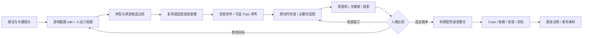

# ARC Mod Harness

**把「我想做这样的 MOD」变成可以逐步制作、比较、返工和交付的项目。**

面向没有完整建模、绑定或游戏工具链经验的作者，也适合与 Codex、其他能读文件和执行工具的 AI 一起使用。核心是一个 **grill-me 式引导技能**：先问清楚你想要什么，再给你可比较的具体画面，每次只推进有依据的一步。

它起源于一次持续约 3–4 天的 Happy Chaos 综合改模项目：人物、身体、服装、表情、动作适配、材质、19 套配色、语音和安装包。之后继续吸收 Gold Ship → Slayer 项目中的原路径替换、崩溃排查、特写与受招动画、材质和性能实测经验。每个案例记录具体修复方法、失败路线与验证边界。

## 先试用

把下面这段发给你的 AI，并让它读取本仓库的 [SKILL.md](skills/arc-mod-harness/SKILL.md)：

> 用 arc-mod-harness 带我做一个 MOD。先像 grill-me 一样问清楚我的想法，一轮只问一到三个最关键的问题。先用我已有的图片、模型和游戏文件判断能做什么。全角色替换时，先用实际游戏截图结合人设三视图生成目标观感，缺三视图时帮我补全，再比较底模与绑定。给我可以比较的目标和实际结果，别让我从一堆技术参数里猜。

Codex 用户可以将整个 `skills/arc-mod-harness` 文件夹放进自己的 skills 目录，再调用 `$arc-mod-harness`。示例安装命令和跨工具用法见 [使用指南](docs/quickstart.md)。技能中的资料和脚本随文件夹一起复制，不依赖本项目的私有工作目录。

### 三条工作路线

| 你的想法 | 建议起点 | 人类最该看的东西 |
|---|---|---|
| 人物、身体、衣服一起改 | 游戏镜头概念 + 三视图 → 底模/绑定比较 → 衣服分件 → 原动作检查 | 真模型三视图、持武器、抬臂和游戏特写 |
| 已有 MOD，只修表情或材质 | 冻结现版 → 定位镜头 → 单问题候选 | 同相机 A/B、控制点投影、过渡帧 |
| 只改配色、语音等 | 跳过不相关建模阶段 | 全配色对应关系、语音触发和最终包 |

完整路线图在 [制作流程](skills/arc-mod-harness/references/workflow.md)。新游戏先填写 [适配器合同](skills/arc-mod-harness/references/adapters.md)，不要直接套用 GGST 的骨名或贴图通道。

## 仓库里有什么

- [技能入口](skills/arc-mod-harness/SKILL.md)：AI 的工作方式、提问、交付和恢复上下文规则。
- [问答设计](skills/arc-mod-harness/references/interview.md)：把“可爱”“不呆”“更有光泽”问成可执行目标。
- [2D 参考与投影](skills/arc-mod-harness/references/visual-targets.md)：image gen/edit 提示模板、三视图检查、眼眉嘴投影方法。
- [底模与绑定选择](skills/arc-mod-harness/references/base-selection.md)：体型相近时优先调查同角色 nude 底模；区分权重迁移和必要的动作适配。
- [分件与 Tripo 参考](skills/arc-mod-harness/references/component-workflow.md)：头发、衣服和饰件各自的 2D/3D 循环与绑定。
- [特蕾西娅 → Dizzy 假设立项](skills/arc-mod-harness/references/theresa-dizzy-example.md)：先预演游戏效果，再选择生产路线。
- [Chaos 子任务例注](skills/arc-mod-harness/references/chaos-subtasks.md)：14 类实际工作、失败和交接边界。
- [纹理 / UV / 材质专题](skills/arc-mod-harness/references/texture-uv-material.md)：AA 丢失、有效像素、mip 驻留、共享图域、颜色与 alpha。
- [风格化线条与 Xrd 技术资料](skills/arc-mod-harness/references/stylized-linework.md)：外轮廓、内部线、Motomura 几何/UV，以及 GGST Tangents/section/顶点色的实际核验。
- [Gold → Slayer 重定向 example](skills/arc-mod-harness/references/gold-retarget-example.md)：实际源轨道、关节运输、UE局部T/Q/S、支撑/换体修复与可运行的合成数学演练。
- [Gold → Slayer 材质 example](skills/arc-mod-harness/references/gold-material-example.md)：皮肤和鞋UV、五图、头身配色、身体作者法线，以及材料合同示例。
- [R213 具体修复方法索引](skills/arc-mod-harness/references/gold-r213-fix-methods.md)：选人/入场、受招飞头、限定火焰、13 族 UV、地影、墨镜和 Kawaii 编辑器专属字段；记录脚本职责、保护字段与失败路线。
- [R213 共用脸部结构线](skills/arc-mod-harness/references/gold-r213-linework-example.md)：按皮肤三角片细分眼褶、同步蒙皮与表情形变，分别验证鼻线可见性及三种头部。
- [R213 语音容器与回导](skills/arc-mod-harness/references/gold-r213-audio-example.md)：最终音频到游戏资源的别名映射、单次编码、原声保留与全量回导检查。
- [R214 全配色与过渡 shader example](skills/arc-mod-harness/references/gold-r214-color-transition-example.md)：动态 Loading/Hidden、精确 Morph shader、Cook cache 到最终包的字节绑定、语义区域转色与失败探索。
- [R214 判定保护审计 example](skills/arc-mod-harness/references/gold-r214-gameplay-preservation-example.md)：原版战斗数据 provider、typed 脚本参数、动画/Notify 与 socket 间接定位的证据边界。
- [R215 嘴角与近景相机](skills/arc-mod-harness/references/gold-r215-entry-camera-example.md)：跨口型包同步闭嘴修正、限定相机窗口、同相位对照与用户接受版归档。
- [R216 2HS 披风锚点](skills/arc-mod-harness/references/gold-r216-cape-anchor-example.md)：从真实动作路由找片段，按同钟胸部锚点修正披风根位移，保留原运动节奏。
- [R217 v5 语音替换](skills/arc-mod-harness/references/gold-r217-voice-v5-example.md)：对实际安装基线做音频差分，显式移除应恢复原声的旧覆盖，保护非音频内容。
- [R218 外部超杀、FD 与性能](skills/arc-mod-harness/references/gold-r218-victim-fd-performance-example.md)：Faust/Potemkin 受招与特写头、独立静态材质祖先的旧缓存、同材质 section 合并和 A/B/A 测量；区分提交量与帧时间。
- [Gold 表情与镜头手 K example](skills/arc-mod-harness/references/gold-face-example.md)：实际活动源、虹膜/视线/闭睫修复，及尚待制作的镜头校正流程，区分驱动覆盖和美术验收。
- [Cook → PAK/SIG → Unverum 安装 example](skills/arc-mod-harness/references/cook-install-example.md)：R09.3 原路径替换、R210 新路径消费者缺口、全量提取哈希、精确配置保留与可运行的合成安装演练。
- [故障排查手册](skills/arc-mod-harness/references/failure-playbook.md)：身体接缝、眉毛扭曲、瞳孔遮挡、黑枪、权重量化等。
- [具体故障案例](skills/arc-mod-harness/references/incident-cards.md)：六组定位/返工过程、具体修复字段、复查步骤与适用边界。
- [完整项目复盘](docs/case-study-happy-chaos.md)：从立项、失败路线到最终修复，以及人类在何时介入。
- [命令行工具](docs/cli.md)：问答记录、哈希追踪、审查页、反馈、版本选择、依赖清单、只读清理计划。
- [合成演练](docs/walkthrough.md)：不需要游戏资产也能跑完整套审查与防错流程。
- [评估用例](evals/scenarios.md)：验证 AI 是否真的理解反馈，而非只说“修好了”。



这是一套工作协议和可运行的管理工具，**不是通用自动改模器**。目前附有 GGST / UE4 的案例适配说明；具体游戏的提取、绑定、Cook 和实机控制仍由相应工具完成。工具能发现文件过期、漏资源和证据类型不符，不能替人判断表情好不好看，也不能凭一份 JSON 证明画面没穿模。

## 本地验证

Python 3.10+，不需要第三方 Python 包：

```sh
python -m unittest discover -s tests -v
python skills/arc-mod-harness/scripts/harness.py init projects/my-mod --name "我的 MOD"
python skills/arc-mod-harness/scripts/harness.py next projects/my-mod
python skills/arc-mod-harness/scripts/harness.py check projects/my-mod
```

本次执行范围见 [验证记录](docs/validation.md)。代码与本文档采用 [MIT License](LICENSE)；
许可证不包含案例涉及的原游戏、第三方模型或语音资产。

复盘中的最终 R09.3 已有打包、安装哈希和原生 UE 预览证据，**没有该版新一轮实机或朋友机器验收记录**。旧版的实机反馈不能替代新版测试。公开仓库不附带游戏模型、原贴图、转换语音或私人对话。
